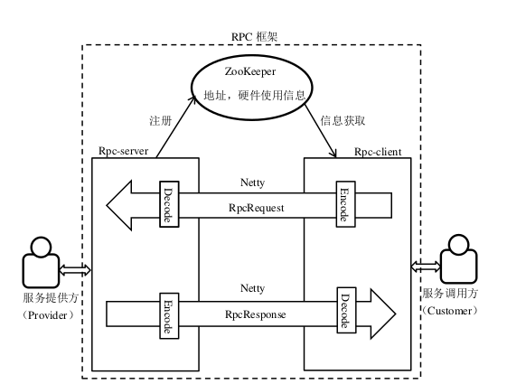
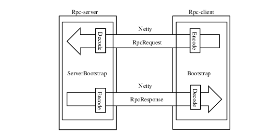
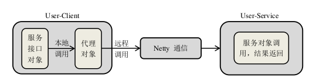
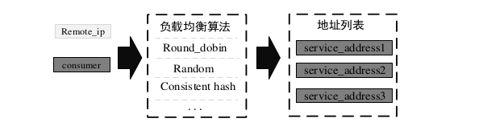
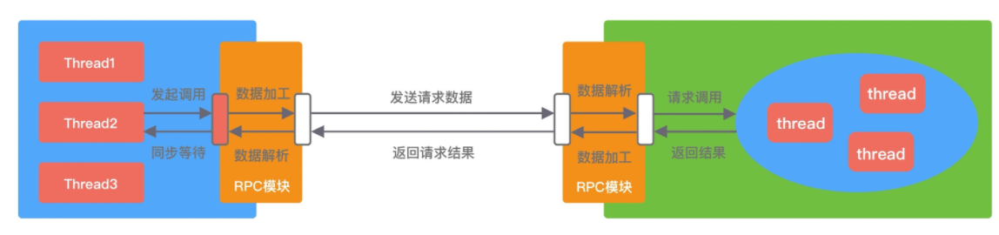
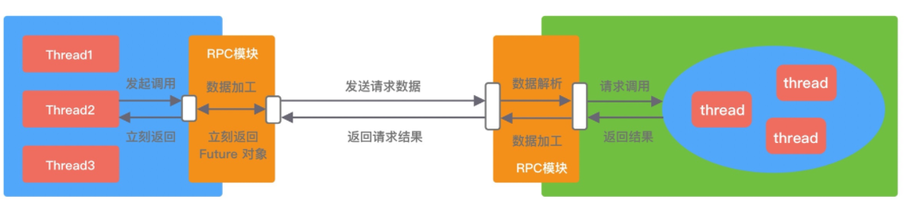
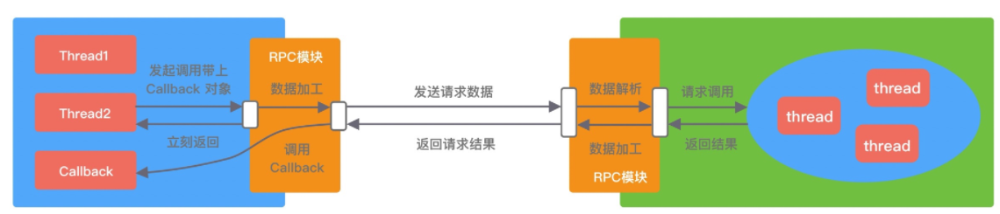
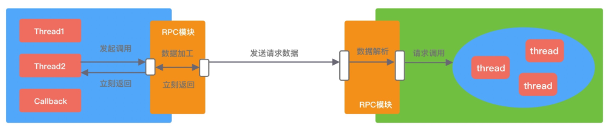
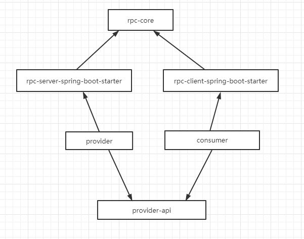

## 架构设计
本框架最核心的两大组件便是 RPC 框架的服务端 Rpc-server 和 RPC 框架的客户端 Rpc-client,
二者通过 Netty 发起请求以及请求的响应

这两大组分别为上层应用的服务发布方与服务调用方所调用, 交互流程为:

- Rpc-server 在启动的时候会将它提供的服务列表发布到注册中心 ZooKeeper 上;
- Rpc-client 启动时通过配置文件获取到 ZooKeeper 地址, 从而得到服务调用地址;
- Rpc-client 通过本地代理模块 Proxy 调用服务端, Proxy 模块收到负责将方法、参数等数据转化成网络字节流;
- Rpc-server 接收到数据后进行解码, 得到请求信息;
- Rpc-server 根据解码后的请求信息调用对应的服务, 然后将调用结果返回给客户端;



## 框架实现功能
### 数据处理功能
#### 1.使用 Netty 网络传输
网络传输是 RPC 最重要也是最基础的功能, 主要是针对服务端 Rpc-server 与客户端 Rpc-client 之间的数据通信

无论是 Rpc-server 还是 Rpc-client,在数据接收之后首先对数据进行解码,还原数据对象, 在数据发送之前先对数据进行编码, 用于数据在网络中的传输.
因此, Netty 代码的 handler 的栈顺序不能弄错, 编码先入栈,然后解码入栈
```
bootstrap.group(eventLoopGroup).channel(NioSocketChannel.class)
.handler(new ChannelInitializer<SocketChannel>() {
    @Override
    protected void initChannel(SocketChannel socketChannel) throws Exception {
        socketChannel.pipeline()
            // 编码 是出栈操作 将消息编写二进制
            .addLast(new RpcEncoder<>())
            // 解码 是入栈操作 将二进制解码成消息
            .addLast(new RpcDecoder())
            // 接收响应 入栈操作
            .addLast(handler);
    }
});
```


##### 1.1 编解码
网络通信双方需拟定好通信数据格式, 根据拟定好的数据格式来才能正确解析对方发送过来的数据.

编解码实现在 `rpc-core` 模块, 在包 `com.zust.rpc.core.codec`下,根据传输协议和序列化进行编码.

编码利用 Netty 的 MessageToByteEncoder 类实现. 实现 encode 方法, MessageToByteEncoder 继承 ChannelOutboundHandlerAdapter, 
编码就是将请求数据写入到 ByteBuf 中
```
@Slf4j
public class RpcEncoder<T> extends MessageToByteEncoder<MessageProtocol<T>> {

    @Override
    protected void encode(ChannelHandlerContext channelHandlerContext, MessageProtocol<T> messageProtocol, ByteBuf byteBuf) throws Exception {
        MessageHeader header = messageProtocol.getHeader();
        // 魔数 2byte
        byteBuf.writeShort(header.getMagic());

        // 协议版本号 1byte
        byteBuf.writeByte(header.getVersion());

        // 序列化算法 1byte
        byteBuf.writeByte(header.getSerialization());

        // 报文类型 1byte
        byteBuf.writeByte(header.getMsgType());

        // 状态 1byte
        byteBuf.writeByte(header.getStatus());

        // 消息 ID 32byte
        byteBuf.writeCharSequence(header.getRequestId(), Charset.forName("UTF-8"));

        RpcSerialization rpcSerialization = SerializationFactory.getRpcSerialization(SerializationTypeEnum.parseByType(header.getSerialization()));
        byte[] data = rpcSerialization.serialize(messageProtocol.getBody());

        // 数据长度 4byte
        byteBuf.writeInt(data.length);

        // 数据内容 长度不固定
        byteBuf.writeBytes(data);
    }
```


解码是利用 Netty 的 ByteToMessageDecoder 类实现. 实现 decode 方法,ByteToMessageDecoder 继承 ChannelInboundHandlerAdapter.  
解码就是将 ByteBuf 中数据解析出请求的数据.

##### 1.2 自定义消息协议
编解码的前提是通信双方事先商量好规则, 服务端知道发送过来的数据将如何解析. 

MessageProtocol由 消息协议头 + 数据内容 构成

+---------------------------------------------------------------+  
| 魔数 2byte | 协议版本号 1byte | 序列化算法 1byte | 报文类型 1byte|  
+---------------------------------------------------------------+  
| 状态 1byte |        消息 ID 8byte     |      数据长度 4byte     |  
+---------------------------------------------------------------+  
|                   数据内容 （长度不定）                         |  
+---------------------------------------------------------------+

- 魔数：魔数是通信双方协商的一个暗号, 通常采用固定的几个字节表示. 魔数的作用是防止任何人随便向服务器的端口上发送数据. 
  例如 java Class 文件开头就存储了魔数 0xCAFEBABE, 在加载 Class 文件时首先会验证魔数的正确性

- 协议版本号：随着业务需求的变化, 协议可能需要对结构或字段进行改动, 不同版本的协议对应的解析方法也是不同的. 

- 序列化算法：序列化算法字段表示数据发送方应该采用何种方法将请求的对象转化为二进制, 以及如何再将二进制转化为对象, 如 JSON、Hessian、Java 自带序列化等. 

- 报文类型： 在不同的业务场景中, 报文可能存在不同的类型. RPC 框架中有请求、响应、心跳等类型的报文. 

- 状态： 状态字段用于标识请求是否正常（SUCCESS、FAIL）. 

- 消息ID： 请求唯一ID, 通过这个请求ID将响应关联起来, 也可以通过请求ID做链路追踪. 

- 数据长度： 标明数据的长度, 用于判断是否是一个完整的数据包

- 数据内容： 请求体内容
#### 2.对象的序列化和反序列化
具体数据内容在网络中的传输只能是以二进制的形式进行. 本框架在使用过程中需要发送 Java 数据对象, Java 数据对象并不能直接通过网络进行传输,
因而 RPC 框架需要具备将 Java 数据对象转换成二进制数据,在将二进制数据发送至网络,即序列化功能. 
同时还需要具备将二进制数据还原成数据对象的功能用于接受网络中的数据,即反序列化功能. 

本框架序列化和反序列化在 `rpc-core` 模块 `com.zust.rpc.core.serialization` 包下, 提供了 `HessianSerialization` 和 `JsonSerialization` 序列化.   
默认使用 `HessianSerialization` 序列化. 用户不可以自定义. 
```
  public static SerializationTypeEnum parseByName(String typeName) {
        for (SerializationTypeEnum typeEnum : SerializationTypeEnum.values()) {
            if (typeEnum.name().equalsIgnoreCase(typeName)) {
                return typeEnum;
            }
        }
        return HESSIAN;
    }

    public static SerializationTypeEnum parseByType(byte type) {
        for (SerializationTypeEnum typeEnum : SerializationTypeEnum.values()) {
            if (typeEnum.getType() == type) {
                return typeEnum;
            }
        }
        return HESSIAN;
    }
```
#### 3.数据封装对象
RPC 框架需为通信双方拟定好请求与响应的数据格式,本框架使用 RpcRequest 与 RpcResponse 对象数据, 这两个对象分别用于封装请求数据与响应数据. 
```
@Data
public class RpcRequest implements Serializable {

    /**
     * 请求的服务名 + 版本
     * 或者说 请求的 接口名 + 版本
     */
    private String serviceName;
    /**
     * 请求调用的方法
     */
    private String method;

    /**
     *  参数类型
     */
    private Class<?>[] parameterTypes;

    /**
     *  参数
     */
    private Object[] parameters;
}
```
### 服务调用功能
服务调用端通过 RPC 框架能够完成服务的准确调用. 
由于服务的调用是远程调用,故不能直接对服务对象进行调用,需有服务的代理对象远程完成该过程
由于相同的服务可以部署在多台不同的主机上,因此 Consumer 端在进行服务调用时,需进行服务调用路由,选出合适主机发送服务调用请求. 
#### 1.动态代理
服务的调用需要通过网络发送请求,并在得到响应后解析出结果作为返回值. 该过程涉及到请求封装和网络通信,而这个过程应该对服务调用方来说是透明的,
因此该过程需要由 RPC 框架来完成. 本框架采用动态代理的方式, 来完成上述过程.  
代理对象需要完成请求封装,并发送请求,在接收到响应后,解析出调用结果并返回给服务调用方. 具体调用过程如下:



在本框架中,获取服务对象主要是通过 JDK注解 + Spring注解扫描 完成被代理对象的获取. 
设计的主要思想是:调用 RPC 框架的服务消费者 User-Client 通过在服务接口上添加 `@RpcAutowired注解`标识该对象将使用代理对象. 
同时在上层应用中引入 Spring 框架,并开启注解扫描功能,
服务消费者启动的时候有个 `RpcClientProcessor` bean 的后置处理器, 会扫描ioc容器中的bean,如果这个bean有属性被`@RpcAutowired注解`修饰, 就给属性动态赋代理对象. 
#### 2.服务发现
本框架的服务发现是基于ZooKeeper做的,  
具体实现在 `rpc-core` 模块, `com.zust.rpc.core.discovery` 包下面是应用于rpc-client的服务发现

随着服务消费者的启动,ZK进行服务发现的初始化.
当服务消费者进行服务调用时先通过ZK查找服务是否存在,之后再进行调用
#### 3.负载均衡策略
在系统中,一台服务器的处理能力有限,为了避免服务器负载过大而发生故障,系统采用服务器集群的形式对外提供服务.
客户端消费者通过一种负载均衡算法将远程请求分流到系统的各个节点服务器中,通过这种方式减轻单台服务器的并发压力.

客户端通过与注册中心 ZooKeeper 相连,读取指定路径下的数据节点,可以获取所有对外提供服务的主机地址.
客户端根据从 ZooKeeper 中获取到的服务信息数据, 通过不同负载均衡算法选择相应的主机发起服务调用请求



负载均衡定义在`rpc-core`中, 目前支持轮询（FullRoundBalance）和随机（RandomBalance）, 默认使用随机策略. 由`rpc-client-spring-boot-starter`指定. 
```
 @Primary
 @Bean(name = "loadBalance")
 @ConditionalOnMissingBean
 @ConditionalOnProperty(prefix = "rpc.client", name = "balance", havingValue = "randomBalance", matchIfMissing = true)
 public LoadBalance randomBalance() {
     return new RandomBalance();
 }

 @Bean(name = "loadBalance")
 @ConditionalOnMissingBean
 @ConditionalOnProperty(prefix = "rpc.client", name = "balance", havingValue = "fullRoundBalance")
 public LoadBalance loadBalance() {
     return new FullRoundBalance();
 } 
```
可以在消费者中配置 `rpc.client.balance=fullRoundBalance` 替换, 也可以自己定义, 通过实现接口 `LoadBalance`, 并将创建的类加入IOC容器即可. 
```
@Slf4j
@Component
public class FirstLoadBalance implements LoadBalance {

    @Override
    public ServiceInfo chooseOne(List<ServiceInfo> services) {
        log.info("---------FirstLoadBalance-----------------");
        return services.get(0);
    }
}
```
### 服务发布功能
服务的发布本质上是对象的方法对外发布,供客户端进行调用. 即客户端通过 RPC 框架,远程调用服务端上的方法. 
在服务发布之前需先获取对应的待发布对象,以便客户端进行远程调用之时, 能够找到具体的服务对象,并完成对该对象的调用
#### 1.反射
与服务调用相似, 服务提供者启动后,通过 Spring 注解扫描 添加了`@RpcService注解`的类,
并将这些暴露的服务添加到服务的本地缓存中(HashMap),供后续库户端使用,避免反复反射实例化服务的开销.
#### 2.服务注册
由于服务注册是基于ZooKeeper做的, 每台服务主机通过在 ZooKeeper 中创建一个临时数据节点. 
数据节点伴随着服务主机的上线而创建,伴随着服务主机的下线而删除. 
数据节点中存放的数据信息主要有服务主机的 IP,端口号,应用名称,服务名称. 用于客户端发起服务调用请求. 

具体实现在 `rpc-core` 模块, `com.zust.rpc.core.register` 包下面是应用于rpc-server的服务注册.   
服务提供者启动后, `RpcServerProvider` 会获取到被 `@RpcService` 修饰的bean, 将服务元数据注册到ZK上. 

## RPC 调用方式  
成熟的 RPC 框架一般会提供四种调用方式, 分别为同步 Sync、异步 Future、回调 Callback和单向 Oneway. 
- Sync 同步调用. 
    客户端线程发起 RPC 调用后, 当前线程会一直阻塞, 直至服务端返回结果或者处理超时异常. 
         

- Future 异步调用    
    客户端发起调用后不会再阻塞等待, 而是拿到 RPC 框架返回的 Future 对象, 调用结果会被服务端缓存, 客户端自行决定后续何时获取返回结果. 当客户端主动获取结果时, 该过程是阻塞等待的
       
    
- Callback 回调调用
    客户端发起调用时, 将 Callback 对象传递给 RPC 框架, 无须同步等待返回结果, 直接返回. 当获取到服务端响应结果或者超时异常后, 再执行用户注册的 Callback 回调 
     

- Oneway 单向调用
    客户端发起请求之后直接返回, 忽略返回结果  
           

这里使用的是第一种：客户端同步调用, 其他的没有实现. 逻辑在 RpcFuture 中, 使用 CountDownLatch 实现阻塞等待（超时等待）  

## 流程
服务提供者启动  
  1. 服务提供者 provider 会依赖 rpc-server-spring-boot-starter  
  2. ProviderApplication 启动, 根据springboot 自动装配机制, RpcServerAutoConfiguration 自动配置生效  
  3. RpcServerProvider 是一个bean后置处理器, 会发布服务, 将服务元数据注册到ZK上  
  4. RpcServerProvider.run 方法会开启一个 netty 服务  
  
服务消费者启动  
  1. 服务消费者 consumer 会依赖 rpc-client-spring-boot-starter  
  2. ConsumerApplication 启动, 根据springboot 自动装配机制, RpcClientAutoConfiguration 自动配置生效    
  3. 将服务发现、负载均衡、代理等bean加入IOC容器  
  4. 后置处理器 RpcClientProcessor 会扫描 bean ,将被 @RpcAutowired 修饰的属性动态赋值为代理对象  
  
调用过程  
  1. 服务消费者 发起请求 http://localhost:9090/hello/world?name=hello  
  2. 服务消费者 调用 helloWordService.sayHello() 方法, 会被代理到执行 ClientStubInvocationHandler.invoke() 方法  
  3. 服务消费者 通过ZK服务发现获取服务元数据, 找不到报错404  
  4. 服务消费者 自定义协议, 封装请求头和请求体  
  5. 服务消费者 通过自定义编码器 RpcEncoder 将消息编码  
  6. 服务消费者 通过 服务发现获取到服务提供者的ip和端口,  通过Netty网络传输层发起调用  
  7. 服务消费者 通过 RpcFuture 进入返回结果（超时）等待
  8. 服务提供者 收到消费者请求
  9. 服务提供者 将消息通过自定义解码器 RpcDecoder 解码  
  10. 服务提供者 解码之后的数据发送到 RpcRequestHandler 中进行处理, 通过反射调用执行服务端本地方法并获取结果
  11. 服务提供者 将执行的结果通过 编码器 RpcEncoder 将消息编码. （由于请求和响应的协议是一样, 所以编码器和解码器可以用一套）  
  12. 服务消费者 将消息通过自定义解码器 RpcDecoder 解码
  13. 服务消费者 通过RpcResponseHandler将消息写入 请求和响应池中, 并设置 RpcFuture 的响应结果
  14. 服务消费者 获取到结果 


## 模块依赖

### 使用maven聚合工程

- rpc           父工程
- consumer, 服务消费者, 是rpc的子工程, 依赖于rpc-client-spring-boot-starter. 
- provider, 服务提供者, 是rpc的子工程, 依赖于rpc-server-spring-boot-starter. 
- provider-api, 服务提供者暴露的服务API, 是rpc的子工程. 
- rpc-client-spring-boot-starter, rpc客户端starter, 封装客户端发起的请求过程（动态代理、网络通信）. 
- rpc-core, RPC核心依赖, 负载均衡策略、消息协议、协议编解码、序列化、请求响应实体、服务注册发现. 
- rpc-server-spring-boot-starter, rpc服务端starter, 负责发布 RPC 服务, 接收和处理 RPC 请求, 反射调用服务端. 

### 依赖图


## 如何使用？
由上面的模块依赖可以知道RPC框架主要是就是以rpc开头的这几个模块, 在使用的时候
- 1.消费者（consumer）需要依赖 `rpc-client-spring-boot-starter`. 
- 2.服务提供者需要依赖 `rpc-server-spring-boot-starter`. 
  这样基本就可以了, 因为使用了spring boot自动配置, 所以消费者和提供者启动的时候都会去加载starter里的spring.factories文件, 会自动将需要的bean自动装配到IOC容器中. 
- 3.注册中心使用ZK
- 4.消费者和服务提供者需要配置注册中心的地址（默认127.0.0.1:2181）以及服务启动端口, 服务提供者还需要配置RPC监听端口. 

## 发布服务和消费服务
- 对于发布的服务需要使用 @RpcService 注解标识, 复合注解, 基于 @Service
```
@RpcService(interfaceType = HelloWordService.class, version = "1.0")
public class HelloWordServiceImpl implements HelloWordService {

    @Override
    public String sayHello(String name) {
        return String.format("您好：%s, rpc 调用成功", name);
    }
}
```

- 消费服务需要使用 @RpcAutowired 注解标识, 复合注解, 基于 @Autowired
```
 @RpcAutowired(version = "1.1")
  private HelloWordService helloWordService;
```

## 项目测试

- 启动 Zookeeper 
- 启动 provider 模块 ProviderApplication
- 启动 consumer 模块 ConsumerApplication
- 测试：浏览器输入 http://localhost:9090/hello/world?name=hello, 成功返回 您好：hello, rpc 调用成功
